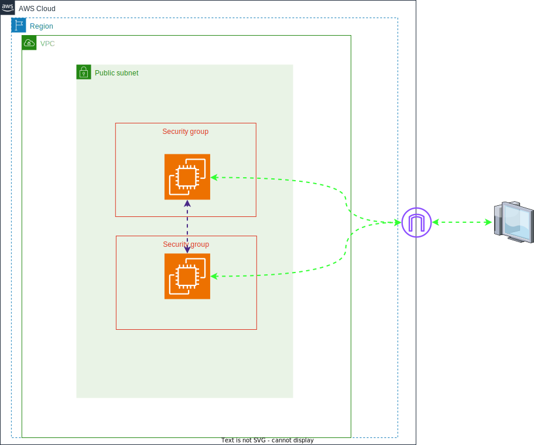

# Atividade Linux - DevSecOps
A primeira atividade de um ciclo de sprints em preparação para DevSecOps,a atividade visa aplicar os conhecimentos previamente adquiridos durante as duas primeiras sprints, que abordaram temas relacionados à AWS (Amazon Web Services) e ao sistema operacional Linux.

## Requisitos para a Atividade.

### Requisitos AWS:
- Gerar uma chave pública para acesso ao ambiente.
- Criar 1 instância EC2 com o sistema operacional Amazon Linux 2 (Família t3.small, 16 GB SSD).
- Gerar 1 elastic IP e anexar à instância EC2.
- Liberar as portas de comunicação para acesso público: (22/TCP, 111/TCP e UDP, 2049/TCP/UDP, 80/TCP, 443/TCP).

### Requisitos no Linux:
- Configurar o NFS entregue.
- Criar um diretório dentro do filesystem do NFS com seu nome.
- Subir um servidor Apache no servidor - o Apache deve estar online e rodando.
- Criar um script que valide se o serviço está online e envie o resultado da validação para o seu diretório no NFS.
- O script deve conter:
  - Data e hora.
  - Nome do serviço.
  - Status (ONLINE ou OFFLINE).
  - Mensagem personalizada.
- O script deve gerar 2 arquivos de saída: 1 para o serviço online e 1 para o serviço OFFLINE.
- Preparar a execução automatizada do script a cada 5 minutos.
- Fazer o versionamento da atividade.

## Cenário de implementação.

## Desenvolvimento da atividade.
### Stage 1 - Desenvolvimento dos scripts e Infraestrutura como Código (IaC)
#### - Desenvolvimento dos scripts.
Nas especificações mencionadas, implementei um script para ser utilizado como **user_data** em máquinas na AWS. Isso significa que quando uma máquina é criada, o script é executado automaticamente no modo superusuário, aplicando as configurações especificadas.

O script **service.sh** fornece uma configuração para a instalação e configuração dos serviços **NGINX** e **NFS**. 

Já na configuração do **serviço**, optei por criá-lo utilizando o **systemd**. Embora houvesse a possibilidade de usar o **CRON**, preferi o **systemd** devido à facilidade de gerenciamento, pois permite ativar e desativar o serviço usando o comando **systemctl <opção> upordown.service**.

#### - Infraestrutura como código.
Com base na descrição da atividade, utilizei o **Terraform** para declarar minha infraestrutura na AWS, incluindo a criação das instâncias EC2, Elastic IP e configurações de segurança. Para simplificar, não foi necessário armazenar o estado da infraestrutura em um **bucket** da AWS, e optei por armazená-lo localmente.
### Stage 2 - Troubleshooting. 
Meu principal desafio durante a implementação desta atividade foi a utilização de **tags** que são obrigatórias para a criação de instâncias na AWS(Em meu cenário). O módulo **EC2_INSTANCE** do Terraform não suporta o atributo **resource_type**, que é comumente usado no console da AWS. Para superar esse obstáculo, tive que pesquisar a documentação do Terraform em busca de uma solução.

Após algumas pesquisas, descobri que o módulo **LAUNCH_TEMPLATE** permitia a especificação dos tipos de recurso das tags. Dessa forma, consegui implantar a infraestrutura corretamente.
